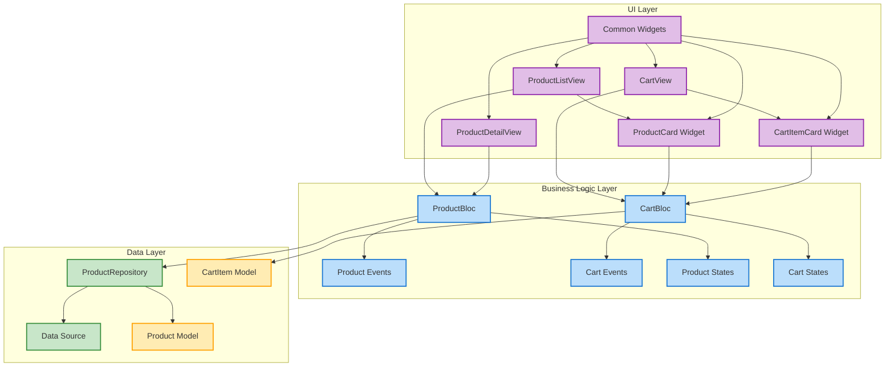

# Flutter BLoC E-commerce Pro 🛍️

<div align="center">

[](https://flutter.dev/)
[](https://bloclibrary.dev/)
[](https://github.com/yourusername/flutter_bloc_ecommerce_pro/stargazers)
[](https://github.com/yourusername/flutter_bloc_ecommerce_pro/network/members)

A professional-grade Flutter e-commerce application demonstrating BLoC pattern implementation in large-scale projects. This project serves as a comprehensive example of implementing clean architecture, SOLID principles, and best practices in Flutter.

[Getting Started](#getting-started) •
[Features](#features) •
[Architecture](#architecture) •
[Screenshots](#screenshots) •
[Contributing](#contributing)

</div>

## 🎯 Project Goals

This project aims to demonstrate:
- Proper implementation of BLoC pattern without Cubit
- Clean Architecture principles in a real-world application
- SOLID principles in Flutter
- Scalable state management for e-commerce features
- Reusable widget patterns
- Responsive design implementation

## ✨ Features

### Implemented
- [x] Product listing with grid view
- [x] Product details with Hero animation
- [x] Shopping cart management
- [x] Quantity controls
- [x] Image caching
- [x] Responsive design
- [x] Common widgets
- [x] Search functionality

### Upcoming
- [ ] User authentication
- [ ] Checkout process
- [ ] Order history
- [ ] Wishlist
- [ ] Product categories
- [ ] Product reviews

## 🏗️ Architecture

### Project Structure

<div align="left">
  <table>
    <tr>
      <th>Project Structure</th>
    </tr>
    <tr>
      <td>
        <pre>
lib/
├── core/
│   ├── constants/
│   │   ├── app_colors.dart
│   │   └── app_typography.dart
│   └── widgets/
│       ├── app_text.dart
│       ├── app_button.dart
│       ├── app_input.dart
│       ├── app_card.dart
│       └── quantity_selector.dart
├── models/
│   ├── product.dart
│   └── cart_item.dart
├── repositories/
│   └── product_repository.dart
├── blocs/
│   ├── product/
│   │   ├── product_bloc.dart
│   │   ├── product_event.dart
│   │   └── product_state.dart
│   └── cart/
│       ├── cart_bloc.dart
│       ├── cart_event.dart
│       └── cart_state.dart
├── views/
│   ├── product_list_view.dart
│   ├── product_detail_view.dart
│   └── cart_view.dart
│── widgets/
│   ├── product_card.dart
│   └── cart_item_card.dart
└── main.dart</pre>
      </td>
    </tr>
  </table>
</div>


### Design Patterns

#### 1. BLoC Pattern
- Separation of UI and business logic
- Event-driven state management
- Unidirectional data flow

```dart
// Example of BLoC implementation
class CartBloc extends Bloc<CartEvent, CartState> {
  CartBloc() : super(CartState()) {
    on<AddToCart>(_onAddToCart);
    on<RemoveFromCart>(_onRemoveFromCart);
    on<UpdateCartItemQuantity>(_onUpdateCartItemQuantity);
  }
  // ... event handlers
}

```


#### 2. Repository Pattern
```dart
abstract class IProductRepository {
  Future<List<Product>> getProducts();
  Future<List<Product>> getProductsByCategory(String category);
  Future<Product?> getProductById(int id);
}
```

#### 3. SOLID Principles

- **Single Responsibility**: Each class has one purpose
- **Open/Closed**: Repository pattern with interfaces
- **Liskov Substitution**: Proper use of abstract classes
- **Interface Segregation**: Specific interfaces for repositories
- **Dependency Inversion**: Dependencies injected through constructors

## 🚀 Getting Started
### Prerequisites

- Flutter SDK (3.0 or higher)
- Dart SDK (2.17 or higher)
- An IDE (VS Code, Android Studio, or IntelliJ)

### Installation

1. Clone the repository
```shellscript
git clone https://github.com/bhautikakbari/flutter_bloc_ecommerce_pro.git
```
2. Install dependencies

```shellscript
cd flutter_bloc_ecommerce_pro
flutter pub get
```
3. Run the app


```shellscript
flutter run
```

## 🤝 Contributing
Fork the Project
Create your Feature Branch (`git checkout -b feature/AmazingFeature`)
Commit your Changes (`git commit -m 'Add some AmazingFeature'`)
Push to the Branch (`git push origin feature/AmazingFeature`)
Open a Pull Request

## 📝 Code Style
This project follows the official [Flutter style guide](https://dart.dev/guides/language/effective-dart/style).

```shellscript
# Run formatter
flutter format .

# Run analyzer
flutter analyze
```

```markdown
## 🏗️ Architecture

[Previous architecture content...]

## 📊 Architecture Diagrams

### System Architecture



## 👤 Author
Bhautik Akbari

- GitHub: [@bhautikakbari](https://github.com/bhautikakbari)
- LinkedIn: [Bhautik Akbari](https://www.linkedin.com/in/bhautik-akbari-155493224/)

## ⭐ Show your support
Give a ⭐️ if this project helped you!
## 📚 Resources

- [Flutter Documentation](https://flutter.dev/docs)
- [Bloc Library](https://bloclibrary.dev/)
- [Flutter Bloc Examples](https://github.com/felangel/bloc/tree/master/examples)

## 🔍 What's Next?

- Implement user authentication
- Add product filtering
- Integrate payment gateway
- Add product reviews
- Implement push notifications
